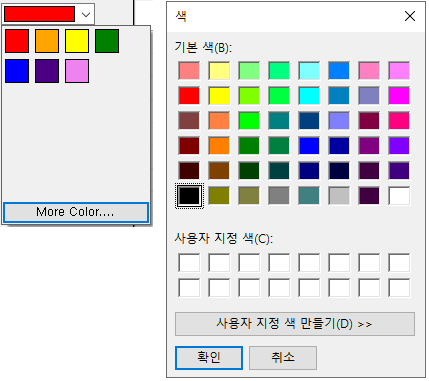
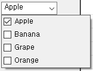
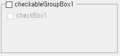
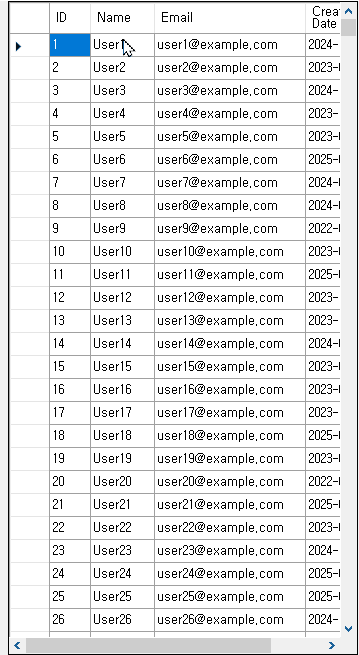
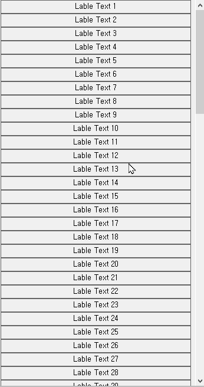

# WinFormsCustomControls

`.NET Framework 4.8` 기반 WinForms 프로젝트에서 사용할 수 있는 커스텀 컨트롤 DLL입니다.

자주 쓰는 UI 패턴을 WinForms 컨트롤로 묶어 재사용하기 쉽게 만든 라이브러리이며, `WinFormsCustomControls.Demo` 프로젝트에서 각 컨트롤의 동작을 확인할 수 있습니다.

## 지원 환경

- Visual Studio
- .NET Framework 4.8
- Windows Forms
- 참조 어셈블리
  - `System.Windows.Forms`
  - `System.Drawing`

## 컨트롤 미리보기

### ColorComboBox



### CheckBoxComboBox



### CheckableGroupBox



### DoubleBufferedDataGridView



### VerticalFlowLayoutPanel



## 컨트롤 목록

| Control | Base Control | Description | 주요 API |
| --- | --- | --- | --- |
| `ColorComboBox` | `ComboBox` | 색상 선택 드롭다운을 제공하는 콤보박스입니다. | `SelectedColor` |
| `CheckBoxComboBox` | `ComboBox` | 체크박스 목록을 드롭다운으로 보여주는 다중 선택 콤보박스입니다. | `AddItem`, `AddItemRange`, `ItemClear`, `GetItems` |
| `CheckableGroupBox` | `ContainerControl` | 체크 상태에 따라 내부 컨트롤을 활성화하거나 비활성화할 수 있는 그룹 박스입니다. | `Checked`, `Text` |
| `DoubleBufferedDataGridView` | `DataGridView` | 많은 행을 표시할 때 깜빡임을 줄이기 위해 더블 버퍼링을 적용한 그리드입니다. | `DataGridView` 기본 API |
| `VerticalFlowLayoutPanel` | `FlowLayoutPanel` | 세로 방향 배치와 스크롤 사용에 맞춘 FlowLayoutPanel입니다. | `FlowLayoutPanel` 기본 API |

## 사용 방법

### DLL 직접 참조

1. 솔루션을 Release 구성으로 빌드합니다.
2. 생성된 DLL을 사용할 WinForms 프로젝트에서 참조로 추가합니다.

```text
WinFormsCustomControls/WinFormsCustomControls/bin/Release/WinFormsCustomControls.dll
```

3. 코드에서 네임스페이스를 추가합니다.

```csharp
using WinFormsCustomControls;
```

### 솔루션에서 프로젝트 참조

같은 솔루션 안에서 사용할 경우, WinForms 앱 프로젝트에 라이브러리 프로젝트를 참조로 추가하면 됩니다.

```text
WinFormsCustomControls/WinFormsCustomControls/WinFormsCustomControls.csproj
```

Visual Studio에서는 사용할 프로젝트를 우클릭한 뒤 `참조 추가` 또는 `프로젝트 참조 추가`에서 `WinFormsCustomControls`를 선택합니다.

## 사용 예시

### ColorComboBox

```csharp
var colorComboBox = new ColorComboBox
{
    SelectedColor = Color.Red,
    Location = new Point(12, 12),
    Width = 120
};

this.Controls.Add(colorComboBox);
```

### CheckBoxComboBox

```csharp
var checkBoxComboBox = new CheckBoxComboBox
{
    Location = new Point(12, 44),
    Width = 160
};

checkBoxComboBox.AddItem("Apple", true);
checkBoxComboBox.AddItem("Banana");
checkBoxComboBox.AddItemRange(new[] { "Grape", "Orange" });

this.Controls.Add(checkBoxComboBox);
```

### CheckableGroupBox

```csharp
var groupBox = new CheckableGroupBox
{
    Text = "Options",
    Checked = true,
    Location = new Point(12, 80),
    Size = new Size(220, 100)
};

groupBox.Controls.Add(new CheckBox
{
    Text = "Enabled when group is checked",
    Location = new Point(16, 28),
    AutoSize = true
});

this.Controls.Add(groupBox);
```

### DoubleBufferedDataGridView

```csharp
var grid = new DoubleBufferedDataGridView
{
    Dock = DockStyle.Fill,
    AutoSizeColumnsMode = DataGridViewAutoSizeColumnsMode.AllCells
};

grid.Columns.Add("ID", "ID");
grid.Columns.Add("Name", "Name");
grid.Rows.Add(1, "User1");

this.Controls.Add(grid);
```

### VerticalFlowLayoutPanel

```csharp
var panel = new VerticalFlowLayoutPanel
{
    Dock = DockStyle.Right,
    AutoScroll = true,
    Width = 240
};

for (int i = 1; i <= 20; i++)
{
    panel.Controls.Add(new Label
    {
        Text = $"Label {i}",
        AutoSize = true
    });
}

this.Controls.Add(panel);
```

## 데모 실행

1. Visual Studio에서 솔루션을 엽니다.

```text
WinFormsCustomControls/WinFormsCustomControls.sln
```

2. `WinFormsCustomControls.Demo` 프로젝트를 시작 프로젝트로 설정합니다.
3. 실행해서 각 컨트롤의 동작을 확인합니다.

## 빌드 및 배포

Release 구성으로 `WinFormsCustomControls` 프로젝트를 빌드하면 다음 위치에 DLL이 생성됩니다.

```text
WinFormsCustomControls/WinFormsCustomControls/bin/Release/WinFormsCustomControls.dll
```

배포할 때는 이 DLL을 사용하는 WinForms 프로젝트에 참조로 추가하면 됩니다.

## License

This project is licensed under the MIT License. See [LICENSE](LICENSE) for details.
